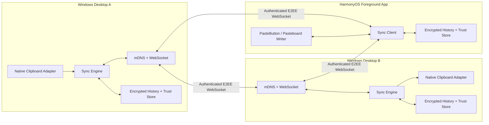

# EggClip（蛋定 Clip）最佳实现方案

## 结论

EggClip v1 应定位为“纯局域网、桌面自动、鸿蒙前台协作”的文本剪贴板同步工具：

- Windows 桌面端使用 Tauri 2、Svelte 5、Rust，开机启动并托盘常驻。
- 桌面端之间通过 mDNS 发现，通过 WebSocket 建立长连接，通过应用层端到端加密传输。
- HarmonyOS 端使用 ArkTS、ArkUI、ArkData，只在前台发现和连接桌面端。
- 桌面端复制的文本可以自动写入其他已配对桌面端；HarmonyOS 端收到后由用户点击写入系统剪贴板。
- HarmonyOS 端发送文本时使用 ArkUI `PasteButton` 获取一次性剪贴板读取授权，再发送给桌面端。
- v1 不使用账号、中心服务器、S3、图片、文件、富文本和后台常驻。

原《EggClip 实现方案》的总体方向成立，但协议、安全和鸿蒙权限边界需要重做。不要直接按原方案开始堆功能，应先完成三个风险验证：Windows 原生剪贴板事件监听、HarmonyOS 真机 mDNS/WebSocket/PasteButton 链路、加密配对互通。

## 1. 产品边界

### 1.1 v1 必须实现

| 场景 | 行为 |
| --- | --- |
| Windows A → Windows B | 自动发现、自动重连、自动同步、自动写入剪贴板 |
| Windows → HarmonyOS | 打开 App 后自动连接和拉取，用户点击“复制到本机” |
| HarmonyOS → Windows | 用户点击系统安全粘贴按钮后读取并发送，桌面自动写入 |
| 设备短时离线 | 两端再次同时在线时补齐历史，但补同步不得覆盖当前剪贴板 |
| 不可信局域网 | 未配对设备无法读取内容、伪造设备或重放历史消息 |

### 1.2 v1 明确不做

- 不做跨公网同步、云备份、S3、账号系统和中心服务。
- 不做 HarmonyOS 后台监听或静默读取系统剪贴板。
- 不做图片、文件、HTML、富文本和超大文本。
- 不做多同步空间、设备转移、复杂组织权限。
- 不做基于正则表达式的“密码识别”。它不能可靠保护敏感信息。

### 1.3 必须接受的限制

- 两台设备只有同时在线并处于可互访的局域网中才能传输。
- Wi-Fi AP 隔离、访客网络、Windows 防火墙或企业网络策略可能阻断发现或入站连接。
- 所有保存过同一空间密钥的设备都属于信任边界。移除设备时必须轮换空间密钥。
- HarmonyOS 公共应用不能把系统级剪贴板读取权限作为前提，用户操作是发送路径的一部分。

## 2. 对原实现方案的修正

| 原建议 | 结论 | 修正 |
| --- | --- | --- |
| Tauri 2 + Svelte + Rust | 保留 | 复用 EggDone 桌面壳和发布工程 |
| ArkTS + ArkUI | 保留 | 复用 EggDoneHarmony 工程分层和视觉 token |
| mDNS + WebSocket | 保留 | mDNS 只做地址发现，不能承担身份认证 |
| 800–1000ms 轮询剪贴板 | 不采用 | Windows v1 使用 `AddClipboardFormatListener` 事件监听；轮询只作跨平台回退 |
| 6 位配对码作为密钥 | 不采用 | 使用 128/256 位一次性随机邀请密钥；6 位码只能做人工确认，不能单独保护配对 |
| SHA-256 内容摘要 | 调整 | 使用 `HMAC-SHA-256(spaceKey, content)`，避免局域网观察者猜测常见文本 |
| `knownItemIds` 摘要补同步 | 不采用 | 使用“来源设备 + 单调序号”游标，支持范围补齐和保留窗口声明 |
| 补到的历史自动写入剪贴板 | 不采用 | 只有在线实时事件可以自动写入；历史补同步只进入历史列表 |
| HarmonyOS 启动后读取当前剪贴板 | 不采用 | 使用 `PasteButton` 在用户点击后获得一次性授权 |
| 第一版后期再加加密 | 不采用 | 配对、身份认证、消息加密必须在 POC 后、MVP 功能前完成 |

## 3. 现有项目的复用策略

EggClip 当前仓库基本为空，已有 `desktop/`、`harmony/` 和 `docs/` 目录，适合直接采用单仓双客户端结构。

### 3.1 从 EggDone 桌面端复用

可复用：

- Tauri 2 + SvelteKit 静态前端工程配置。
- 托盘图标、左键切换面板、失焦隐藏、面板定位和关闭转隐藏。
- 单实例插件、开机启动插件和应用生命周期装配。
- SQLite WAL、顺序 migration、事务和测试结构。
- 系统凭据库 `keyring` 的封装模式。
- Rust command / TypeScript API / Svelte store 的分层。
- 亮暗主题、圆角卡片、蛋黄色强调色、安装包验证和发布检查。

不复用：

- Todo、分组、提醒、重复任务、S3 同步和 JSON 合并业务。
- EggDone 的 `todos.json` 同步模型。剪贴板是不可变事件流，不是可编辑实体集合。
- 单页堆叠全部业务状态的写法。EggClip 应从第一天拆分页面、组件、store 和 service。

### 3.2 从 EggDoneHarmony 复用

可复用：

- HarmonyOS 6、ArkTS、ArkUI、Stage Model 工程骨架。
- `models/`、`store/`、`data/`、`services/`、`theme/` 的分层约定。
- ArkData RDB migration、repository、设备 ID 和生命周期处理模式。
- `EggColors`、`EggSpacing`、`EggTypography` 及手机/平板响应式布局思路。
- 深色背景、蛋黄色主色、28vp 大圆角、18vp 中圆角的产品家族风格。
- Hvigor 构建、测试和发布回归文档结构。

不复用：

- S3 签名、同步文档和 Todo 仓储。
- EggDoneHarmony 的签名材料与本机路径。EggClip 必须使用本机未提交配置或 CI secret。
- 把大量 UI 和业务状态集中在 `Index.ets` 的结构。

## 4. 推荐系统架构



### 4.1 仓库结构

```text
eggclip/
├─ desktop/                 # Tauri 2 + Svelte 5 + Rust
│  ├─ src/
│  └─ src-tauri/src/
├─ harmony/                 # DevEco Studio HarmonyOS 工程
├─ protocol/
│  ├─ v1.schema.json        # 消息 JSON Schema
│  ├─ test-vectors/         # 握手、加密、游标、错误消息样例
│  └─ README.md             # 状态机和兼容规则
├─ docs/
│  ├─ SECURITY.md
│  ├─ MANUAL_REGRESSION.md
│  └─ EggClip最佳实现方案.md
└─ README.md
```

两个客户端不共享运行时代码，只共享协议定义、测试向量、视觉规范和验收用例。这比维护 ArkTS/Rust 跨语言公共库更简单。

### 4.2 桌面端模块

```text
src-tauri/src/
├─ app/                     # Tauri 装配、生命周期、command
├─ tray/                    # 托盘、弹窗定位、菜单、状态图标
├─ clipboard/
│  ├─ mod.rs                # ClipboardPort trait
│  ├─ windows.rs            # AddClipboardFormatListener
│  └─ fallback.rs           # macOS/Linux 后续回退
├─ discovery/               # mDNS 发布、浏览、上次地址回退
├─ transport/               # WebSocket server/client、连接去重、心跳
├─ protocol/                # v1 envelope、校验、大小限制
├─ pairing/                 # 邀请、二维码、信任建立、设备移除
├─ crypto/                  # identity、handshake、AEAD、replay window
├─ sync/                    # 实时事件、补同步、回环抑制、HLC
├─ storage/                 # SQLite migration、repository、retention
└─ settings/                # autostart、隐私、设备、诊断
```

### 4.3 HarmonyOS 模块

```text
entry/src/main/ets/
├─ pages/                   # Home、Pairing、Devices、Settings
├─ components/              # ClipboardCard、DeviceChip、EmptyState
├─ models/                  # ClipboardItem、Peer、ProtocolMessage
├─ store/                   # ClipboardStore、ConnectionStore、SettingsStore
├─ data/                    # RDB、migration、repository
├─ services/
│  ├─ discovery/            # @ohos.net.mdns
│  ├─ transport/            # @ohos.net.webSocket
│  ├─ clipboard/            # PasteButton 授权读取、pasteboard 写入
│  ├─ crypto/               # CryptoFramework/HUKS
│  └─ sync/                 # 前台同步和补同步
└─ theme/                   # Colors、Spacing、Typography
```

## 5. 连接与发现

### 5.1 mDNS

- 服务类型：`_eggclip._tcp.local.`。
- TXT 仅发布 `protocolVersion`、临时实例 ID 和能力位。
- 不广播剪贴板内容、空间名称、用户名称、长期公钥或 `spaceKey`。
- mDNS 只返回候选地址。连接后必须完成身份认证。
- 发现失败时可以尝试最近成功地址，但仍必须重新认证。

### 5.2 WebSocket

- 桌面端同时具备 server/client 能力；HarmonyOS 只作为 client。
- 桌面端使用 Rust async runtime 和 WebSocket server，HarmonyOS 使用 NetworkKit WebSocket。
- 建议 v1 使用 JSON 文本帧和 Base64 密文，单条明文最大 256 KiB，单帧最大 1 MiB。
- 连接需要心跳、带抖动指数退避、网络切换重连和明确的最大消息大小。
- 绑定 IPv4 局域网地址作为 MVP；IPv6 放到 v1.1。

### 5.3 双连接去重

两个桌面端可能同时发起连接。完成认证后按以下规则只保留一条：

1. `deviceId` 字典序较小的一方是预期发起者。
2. 若现有连接方向符合规则，关闭新连接；否则替换旧连接。
3. 每个 `peerDeviceId` 在 `ConnectionManager` 中最多有一个 active session。

## 6. 配对和密钥方案

### 6.1 设备身份

每台设备首次启动生成：

- 随机 `deviceId`。
- Ed25519 长期身份密钥，用于签名。
- X25519 临时会话密钥，用于每次连接协商。
- 本地加密主密钥，用于历史和信任库。

桌面端私钥保存在系统凭据库；HarmonyOS 私钥优先放入 HUKS，不写入 RDB、日志或二维码。

### 6.2 创建空间

创建空间时生成随机 `spaceId` 和 256 位 `spaceKey`。`spaceId` 只是标识；`spaceKey` 是成员凭据，必须加密保存。

### 6.3 邀请

二维码或邀请字符串包含：

```json
{
  "app": "EggClip",
  "protocolVersion": 1,
  "spaceId": "...",
  "inviterDeviceId": "...",
  "inviterPublicKey": "...",
  "pairingSessionId": "...",
  "pairingSecret": "256-bit random value",
  "endpoints": ["192.168.1.20:38765"],
  "expiresAt": 1781949600000
}
```

要求：

- 邀请 5 分钟过期且只能使用一次。
- 桌面互配使用“复制邀请字符串”，不要手输高熵密钥。
- 如果展示 6 位确认码，它只用于双方人工核对，不参与单独认证。
- 配对安全通道建立后再传输 `spaceKey` 和成员信息。
- 配对秘密和完整邀请内容不得进入日志、崩溃报告或剪贴板历史。

### 6.4 会话加密

- X25519 协商每次连接的临时共享秘密。
- Ed25519 签名绑定设备身份、空间和握手 transcript。
- HKDF-SHA-256 派生双向会话密钥。
- AES-256-GCM 加密认证后全部业务消息。
- 每个方向使用独立密钥和单调消息计数器，计数器参与 nonce 构造。
- 收到旧计数器、重复 `messageId` 或认证失败的帧立即拒绝。

不要自行创造不带安全证明的新密码协议。实现时应固定算法、字段编码和测试向量，并完成 Rust 与 ArkTS 交叉验证。

## 7. 同步协议

### 7.1 不可变事件模型

剪贴板记录是不可变事件，不做 Todo 式字段合并：

```json
{
  "itemId": "uuid-v7",
  "spaceId": "uuid",
  "originDeviceId": "uuid",
  "originSeq": 42,
  "hlc": "1781946000123:0:device-short-id",
  "contentType": "text/plain",
  "contentLength": 18,
  "contentDigest": "hmac-sha256",
  "createdAt": 1781946000123,
  "content": "example text"
}
```

- `originSeq` 是来源设备持久化单调序号，用于补同步。
- `hlc` 是 Hybrid Logical Clock，用于多设备近同时复制时的稳定排序。
- `createdAt` 只用于展示，不作为唯一冲突依据。
- `contentDigest` 使用 HMAC，不使用裸 SHA-256。

### 7.2 消息类型

```text
CLIENT_HELLO / SERVER_HELLO
AUTH_PROOF / AUTH_OK / AUTH_ERROR
SYNC_HEADS
REQUEST_RANGE
ITEM_BATCH
ITEM_LIVE
ITEM_ACK
DEVICE_REVOKED / SPACE_KEY_ROTATED
PING / PONG
ERROR
```

认证前只允许握手消息；认证后才允许同步消息。每个消息 envelope 包含 `version`、`type`、`messageId`、`sessionCounter` 和密文。

### 7.3 补同步游标

每台设备维护：

```json
{
  "heads": {
    "device-a": 120,
    "device-b": 67
  },
  "minimumAvailable": {
    "device-a": 71,
    "device-b": 18
  }
}
```

对端按缺失范围请求，例如 `device-a: 115..120`。超过本地保留窗口时返回明确的 gap，不伪装成已完整同步。

### 7.4 实时与历史必须分离

- `ITEM_LIVE`：连接已在线时产生的新复制事件，可以按策略自动写入桌面剪贴板。
- `ITEM_BATCH`：离线补齐历史，只写入历史数据库和 UI，不得自动覆盖系统剪贴板。
- HarmonyOS App 启动时拉到的内容均按历史处理，首页展示“最新收到”，由用户点击复制。

这一条可避免“电脑刚复制了内容，另一台设备上线后却用昨天的历史覆盖”的严重体验问题。

## 8. 剪贴板处理

### 8.1 Windows

使用 Win32 `AddClipboardFormatListener` 监听 `WM_CLIPBOARDUPDATE`，不要以 1 秒轮询作为正式实现。读取流程：

1. 收到系统事件。
2. 检查是否为本应用刚写入的远端内容。
3. 读取纯文本并统一编码为 UTF-8。
4. 拒绝空文本、超过 256 KiB 的文本和不支持的格式。
5. 生成 item、事务写入本地、再异步广播。

远端写入前记录 `(digest, clipboardSequence, deadline)`。系统回调命中该标记时只确认写入，不再生成新 item。`itemId` 去重和 digest 抑制要同时存在。

如果能读到 Windows `CanIncludeInClipboardHistory=0` 或 `ExcludeClipboardContentFromMonitorProcessing` 等提示，应尊重它们；读取不到时不能宣称已自动过滤密码管理器内容。

### 8.2 HarmonyOS

本机 SDK `6.1.1(24)` 显示：

- `pasteboard.setData()` 可用于把选中的远端记录写入系统剪贴板。
- `pasteboard.getData()` 在新 API 上要求 `ohos.permission.READ_PASTEBOARD`。
- 该权限为 `system_basic`、`user_grant`，普通三方应用不能把它当成常规授权路径。
- ArkUI `PasteButton` 是安全组件，可在用户点击时临时授权读取当前剪贴板。

因此首页应使用真正的 `PasteButton` 作为“粘贴并发送”控件，不要用普通 Button 模拟。点击成功后立即读取、预览并发送；授权失败时不降级为静默读取。

## 9. 本地存储

### 9.1 推荐表

```text
clipboard_items
  item_id, origin_device_id, origin_seq, hlc,
  content_type, content_digest, encrypted_content,
  created_at, received_at, expires_at

devices
  device_id, display_name, identity_public_key,
  trust_state, paired_at, last_seen_at, revoked_at

spaces
  space_id, display_name, encrypted_space_key, key_version

sync_heads
  peer_device_id, origin_device_id, highest_origin_seq

app_metadata
  key, value

schema_migrations
  version, applied_at
```

### 9.2 保留策略

- 默认保存最近 50 条，且最长 7 天；两个条件任一满足即清理。
- 设置允许 0、20、50、100 条；0 表示不保留历史，但仍保留必要的短期去重游标。
- 内容字段加密，索引字段最小化明文暴露。
- “清空历史”应删除记录并触发 SQLite 清理策略；不要承诺闪存上的物理不可恢复擦除。
- 应用日志只能记录 item ID、大小、类型、错误码和耗时，不记录内容、摘要、邀请或密钥。

## 10. UI 与产品风格

EggClip 应属于 EggDone 同一产品家族，但不要把 Todo 页面换字后直接复用。

### 10.1 视觉规范

- 继续使用蛋黄色主色、暖黑深色主题、低对比卡片和大圆角。
- 使用现有 EggClip 吉祥物图标作为品牌入口；列表中只保留小尺寸图标，避免挤压内容。
- 桌面面板宽约 420–460 px，历史列表优先展示文本预览、来源设备、时间和复制动作。
- 设备状态使用低干扰圆点：绿色在线、黄色连接中、灰色离线、红色认证失败。
- 默认遮住长文本中部，只显示首尾和字符数；点击后展开。

### 10.2 桌面信息架构

```text
顶部：品牌 + 连接状态 + 设置
当前剪贴板：大卡片、来源、时间、复制/删除
设备：在线设备 chips
历史：最近记录列表
底部：同步开关 + 暂停状态 + 隐私提示
```

托盘菜单：

```text
打开 EggClip
同步状态：2 台在线
暂停同步 / 恢复同步
清空当前剪贴板历史
设备管理
设置
退出
```

### 10.3 HarmonyOS 信息架构

```text
顶部：品牌 + 当前连接设备
最新收到：预览 + “复制到本机”
发送到电脑：系统 PasteButton “粘贴并发送”
最近记录：卡片列表
底部或二级页：设备、设置、关于
```

平板使用双栏：左侧设备/历史，右侧内容预览；手机保持单栏。

## 11. 推荐依赖

桌面 Rust 候选：

- `tauri`、`tauri-plugin-single-instance`、`tauri-plugin-autostart`
- `rusqlite`（bundled）
- `tokio`、`tokio-tungstenite`
- `mdns-sd`
- `serde`、`serde_json`
- `uuid`（v7）
- `ed25519-dalek`、`x25519-dalek`、`hkdf`、`sha2`、`hmac`、`aes-gcm`
- `keyring` 或操作系统原生凭据库
- Windows target 下的 `windows` crate，用于原生剪贴板事件

依赖版本应在创建工程时锁定并跑许可证、漏洞和最小 Rust 版本检查。HarmonyOS 侧优先使用 SDK 自带 NetworkKit、CryptoFramework、HUKS、Pasteboard 和 ArkData，不引入无法审计的密码学第三方包。

## 12. 实施顺序

### 阶段 0：技术风险 POC

只验证，不做完整 UI：

1. 两个 Windows 进程之间手动 IP WebSocket 互传文本。
2. Win32 剪贴板事件监听和远端写入防回环。
3. HarmonyOS 真机通过 mDNS 找到桌面服务并建立 WebSocket。
4. HarmonyOS `PasteButton` 读取并发送，收到文本后 `setData` 写入。
5. Windows 防火墙、访客 Wi-Fi、断网重连的失败表现。

退出条件：上述链路在至少一台 Windows 真机和一台 HarmonyOS 真机通过。模拟器不能替代局域网、PasteButton 和权限验收。

### 阶段 1：桌面 MVP

- 从 EggDone 提取桌面壳、主题和 SQLite migration。
- 完成剪贴板 adapter、历史库、手动 IP 连接、实时/历史分流。
- 完成托盘状态、暂停同步、历史清理和基础测试。

退出条件：两台 Windows 连续运行 2 小时无回环、无重复连接、无 UI 卡顿。

### 阶段 2：配对与安全

- 实现身份密钥、邀请、一次性配对、加密握手和消息 AEAD。
- 建立跨语言测试向量。
- 实现设备移除、密钥轮换和日志脱敏。

退出条件：抓包看不到剪贴板明文；错误密钥、重放帧、过期邀请和未知设备均被拒绝。

### 阶段 3：自动发现和可靠性

- 完成 mDNS、最近地址回退、双连接去重、心跳和重连。
- 完成游标补同步、gap 响应、保留清理和 HLC 排序。

退出条件：设备重启、IP 变化、网络切换和短时离线后能恢复；补同步不覆盖当前剪贴板。

### 阶段 4：HarmonyOS 客户端

- 复用 EggDoneHarmony 的工程分层和视觉 token。
- 完成扫码/邀请导入、前台发现、连接、历史和复制。
- 用 `PasteButton` 完成 HarmonyOS → desktop。
- 完成手机/平板布局和生命周期处理。

退出条件：应用市场可接受的权限集合下，真机双向流程完整通过。

### 阶段 5：发布准备

- Windows 安装、覆盖升级、卸载、开机启动和防火墙提示回归。
- HarmonyOS 正式签名、隐私说明、权限说明和应用市场材料。
- 完成威胁模型、手动回归、协议兼容和数据库迁移测试。

## 13. 测试重点

### 单元测试

- 协议 schema、未知字段、旧版本和最大消息大小。
- HLC、originSeq、范围补齐和 retention gap。
- digest、回环抑制、重复 item 和重复 ACK。
- 邀请过期、一次性消费、密钥派生、nonce 和重放窗口。
- 数据库 migration、崩溃恢复和并发写入。

### 集成测试

- Rust ↔ Rust、Rust ↔ ArkTS 加密测试向量。
- 双方同时连接时只保留一条 session。
- A/B 同时复制时最终顺序一致。
- 断网期间产生多条记录，重连后只补缺失范围。
- 收到历史 batch 时不写入系统剪贴板。
- 删除设备后旧设备无法重新连接。

### 真机回归

- Windows 10/11、多显示器、125%/150%/200% DPI。
- Windows 防火墙首次提示、专用/公用网络。
- HarmonyOS 手机和平板、前后台切换、Wi-Fi 切换。
- 路由器 AP 隔离、mDNS 不可用、IP 变化。
- 10 万字符、Emoji、换行、中文、空文本和超限文本。

## 14. 最大风险与决策门

| 风险 | 影响 | 决策 |
| --- | --- | --- |
| HarmonyOS mDNS 在目标真机/网络不稳定 | 无法自动发现 | 阶段 0 真机验证；保留扫码地址和最近 IP 回退 |
| `READ_PASTEBOARD` 无法供三方应用常规申请 | 无法静默发送 | 正式采用 `PasteButton`，产品文案写清用户动作 |
| Windows 防火墙阻止入站 | 桌面互联失败 | 首次连接向导诊断；提供手动 IP 和网络类型说明 |
| 自研握手实现错误 | 内容泄漏或身份伪造 | 固定标准原语和 transcript；跨语言向量；安全审查后发布 |
| 历史内容包含密码或 Token | 隐私事故 | 加密存储、短保留、暂停/清空、尊重系统排除标志、禁止内容日志 |
| 全 mesh 设备数增长 | 连接和状态复杂 | v1 限制建议设备数 5；超过后再评估局域网协调节点或可选中继 |

## 15. 最终技术决策

最佳方案不是“把 EggDone 的 S3 同步替换成 WebSocket”，而是：

1. 复用 EggDone 的桌面基础设施、工程质量和视觉语言。
2. 复用 EggDoneHarmony 的 ArkTS 分层、ArkData 和视觉 token。
3. 为 EggClip 新建不可变事件流协议、实时/历史双通道语义和端到端加密配对。
4. Windows 使用事件驱动剪贴板监听；HarmonyOS 使用用户触发的安全粘贴能力。
5. 先验证平台风险，再做完整 UI；安全能力在 MVP 中完成，不留到“后续优化”。

这条路线能保留“桌面无感、鸿蒙打开即用、不依赖服务器”的产品目标，同时避免原方案中最容易返工的权限、回环、历史覆盖、弱配对和裸摘要问题。

## 参考依据

- 初始方案：`C:\Users\caozhipeng\Desktop\EggClip实现方案.md`
- 桌面参考项目：`D:\Develop\EggDone`
- HarmonyOS 参考项目：`D:\Develop\EggDoneHarmony\EggDone`
- 本机 HarmonyOS SDK：`6.1.1(24)`，检查了 Pasteboard、PasteButton、mDNS、WebSocket、CryptoFramework 和 HUKS 类型定义。
- [Tauri Clipboard 官方文档](https://v2.tauri.app/plugin/clipboard/)
- [Tauri Autostart 官方文档](https://v2.tauri.app/plugin/autostart/)
- [Tauri System Tray 官方文档](https://v2.tauri.app/learn/system-tray/)
- [HarmonyOS Pasteboard 官方文档](https://developer.huawei.com/consumer/cn/doc/harmonyos-references/js-apis-pasteboard)
- [HarmonyOS mDNS 官方文档](https://developer.huawei.com/consumer/cn/doc/harmonyos-references/js-apis-net-mdns)
