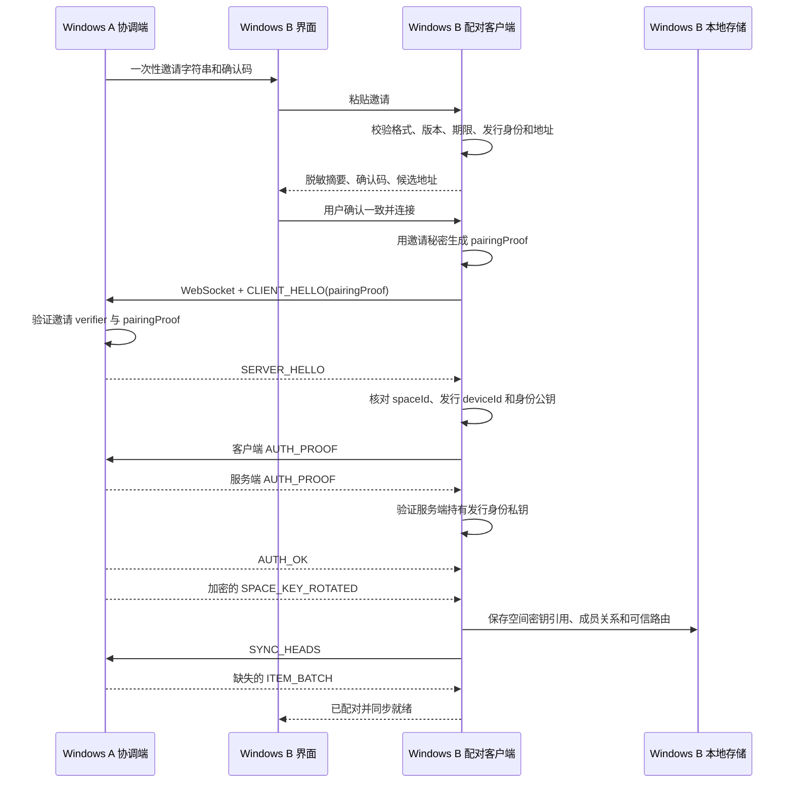

# EggClip Windows 客户端互联剪贴板实现方案

## 1. 结论

EggClip v1 应补齐 Windows A 与 Windows B 之间的正式剪贴板同步。现有代码已经具备协议、设备身份、邀请生成、认证服务端、空间密钥、认证会话、实时同步、离线补齐和回环抑制。缺口集中在桌面端的配对客户端角色、加入空间后的持久化、可信主动重连和面向用户的加入流程。

本方案不设计第二套桌面业务协议，也不把实验性 POC 连接直接升级为可信连接。Windows 加入方复用现有消息类型，但必须先把握手补成双向认证：邀请秘密绑定 `CLIENT_HELLO`，客户端和服务端分别提交 Ed25519 `AUTH_PROOF`，随后才进入 `AUTH_OK`。认证后继续复用现有 `ITEM_LIVE`、`SYNC_HEADS`、`REQUEST_RANGE`、`ITEM_BATCH` 和 `ITEM_ACK`。

分析现有实现时发现两个安全前置问题：

- 邀请中包含 256 位 `pairingSecret`，数据库也保存其 verifier，但当前网络握手没有提交或验证基于该秘密的证明。
- 当前只有客户端发送 Ed25519 `AUTH_PROOF`；客户端核对服务端公钥，却没有验证服务端持有对应私钥。

Windows↔Windows 不能建立在这两个缺口上。Roadmap 第一项必须先修复共享握手，并同步更新 HarmonyOS。已有可信设备记录和空间密钥不需要清除，但旧版本客户端升级前不能再执行新配对或可信重连。

目标体验：

1. Windows A 在现有同步空间中生成邀请。
2. Windows B 粘贴邀请并核对六位确认码。
3. Windows B 自动选择邀请中的局域网地址并完成安全配对。
4. 此后两台电脑启动 EggClip 时自动发现、自动重连和补同步。
5. 任一电脑产生新的文本剪贴板内容，另一台电脑自动写入系统剪贴板。

## 2. 当前基线与缺口

| 能力 | 当前状态 | 补齐内容 |
| --- | --- | --- |
| Windows 原生剪贴板监听与写入 | 已完成 | 直接复用 |
| 远端写入回环抑制 | 已完成 | 增加网络事件级去重，防止多设备转发环路 |
| 邀请生成、二维码和一次性秘密 | 已完成 | 增加 Rust 邀请解析和桌面加入界面 |
| 邀请秘密的网络证明 | 未接入握手 | 增加与客户端身份和临时密钥绑定的 HMAC proof |
| 桌面端配对服务端 | 已完成 | 保持兼容 |
| 桌面端配对客户端 | 未实现 | 新增客户端握手状态机和身份签名 |
| 服务端身份私钥证明 | 未实现 | 服务端增加 Ed25519 `AUTH_PROOF`，客户端验证后才接受 `AUTH_OK` |
| WebSocket 主动连接 | 只有 POC | 新增正式认证主动连接，不能复用 POC 信任状态 |
| 空间密钥接收与保存 | HarmonyOS 已实现 | Windows 使用系统凭据库保存接收的空间密钥 |
| 可信重连服务端 | 已完成 | 新增桌面端可信重连客户端 |
| mDNS 发布和发现 | 已完成 | 按可信设备 ID 匹配候选地址并主动拨号 |
| `ITEM_LIVE` 双向收发 | 已完成 | 让客户端方向的认证会话进入同一会话注册表 |
| 离线补齐 | 已完成 | 验证客户端方向同样发送和处理 `SYNC_HEADS` |
| 多设备实时分发 | 本地事件可广播；远端事件不转发 | 增加首次事件的同空间安全转发 |
| Windows 加入另一台电脑的 UI | 未实现 | 增加粘贴邀请、确认码、地址选择和进度反馈 |

## 3. 范围

### 3.1 本次实现

- 两台或多台 Windows 设备通过同一同步空间共享 `text/plain`。
- 邀请发起电脑作为该空间的本地协调端，接受加入设备的连接。
- 加入电脑主动连接邀请发起电脑，并保存可信路由。
- Windows 启动后自动发现并重连协调端。
- 实时内容自动写入 Windows 系统剪贴板。
- 离线内容只进入历史，不覆盖当前系统剪贴板。
- 支持同一空间内 Windows 与 HarmonyOS 设备同时在线。
- 协调端把首次收到的实时事件转发给同空间的其他在线设备。
- 继续执行 256 KiB 文本限制、五台设备建议上限、历史和保留策略。

### 3.2 不在本次实现

- 公网同步、账号、云服务和中继服务器。
- Windows 设备之间的任意网状连接和自动选主。
- 同步空间合并、设备迁移或冲突空间自动合并。
- 图片、文件、HTML、富文本和剪贴板格式转换。
- 通过 mDNS、IP 地址或设备名称建立信任。
- 将 POC 手动连接显示为可信设备。

## 4. 核心架构决策

### 4.1 使用协调端拓扑，不做全网状连接

本地创建空间的 Windows 设备是该空间的协调端。通过它的邀请加入空间的 Windows 设备是成员端。

- 协调端监听 WebSocket、发布 mDNS，并接受成员连接。
- 成员端主动发现和连接协调端。
- 协调端可以邀请 Windows 或 HarmonyOS 设备。
- 成员端不能继续为该空间生成邀请，也不能替协调端轮换空间密钥。
- 协调端离线时，成员保留本地复制和历史；协调端恢复后再补同步。

该拓扑与当前 HarmonyOS → Windows 连接方向一致，避免双向拨号、连接抢占和网状信任传播。它仍是纯局域网架构，协调端不是云服务器。

### 4.2 配对方向固定

首次配对和后续可信重连都遵守同一方向：

- 邀请发起方：服务端、被动接受连接。
- 邀请加入方：客户端、主动建立连接。

每个可信关系持久化 `dialRole`：

- `acceptOnly`：本机是邀请发起方，不主动拨号。
- `dialCoordinator`：本机是加入方，主动连接协调端。

固定方向使每个 `peerDeviceId` 只产生一个 active session，现有连接去重逻辑仍可使用。

### 4.3 保持业务协议 v1，升级配对握手

业务消息、密码算法和 envelope 版本保持不变。配对握手升级为 invitation v2：

- 邀请 payload 的 `version` 提升为 `2`，新配对 context 使用 `pairing-invitation:v2:<invitationId>`。
- `HelloPayload` 增加仅用于 invitation pairing 的 `pairingProof`。可信重连必须省略该字段。
- 客户端按现有 verifier 算法从 `pairingSecret` 和 `invitationId` 派生 32 字节 verifier，以 verifier 字节为 HMAC 密钥，对发行身份、空间和客户端身份组成的固定 canonical claim 计算 HMAC-SHA-256。
- 服务端使用数据库中的 verifier 验证 proof；proof 不匹配时，在生成可信设备前拒绝连接。
- 客户端发送 role=`client` 的 Ed25519 `AUTH_PROOF` 后，服务端还要发送 role=`server` 的 Ed25519 `AUTH_PROOF`。
- 客户端使用邀请中的发行身份公钥或可信记录中的协调端公钥验证服务端 proof，验证通过后才接受 `AUTH_OK`。
- 可信重连继续使用 `trusted-device:<spaceId>:key-v<version>`，但同样执行双向身份签名。
- 会话继续使用 X25519、HKDF-SHA-256 和 AES-256-GCM。
- 初次空间密钥和落后版本密钥继续通过认证后的 `SPACE_KEY_ROTATED` 传递。

固定 pairing claim：

```text
EggClip pairing secret proof v2
invitationId=<uuid>
spaceId=<uuid>
issuerDeviceId=<uuid>
issuerIdentityPublicKey=<base64url>
clientDeviceId=<uuid>
clientIdentityPublicKey=<base64url>
clientEphemeralPublicKey=<base64url>
```

canonical claim 使用 UTF-8、固定 LF 换行和结尾 LF。`pairingProof` 使用 Base64URL 编码。实现时必须更新 `protocol/v1.schema.json`、协议说明、Rust/ArkTS 类型、HarmonyOS 配对客户端、Rust 配对服务端和共享测试向量。旧 v1 邀请最长只存活五分钟，可以明确拒绝；不要保留不验证秘密的兼容分支。

### 4.4 POC 与正式连接严格分离

`connect_poc_peer` 只保留在高级诊断中。正式 Windows 互联使用新的认证连接入口和状态机。

禁止以下做法：

- 连接到一个 IP 后直接标记为可信。
- 复用 POC peer 名称作为设备身份。
- 在认证前发送剪贴板正文。
- 因为 mDNS 发现了相同名称就跳过身份验证。

### 4.5 实时转发不经过系统剪贴板监听

协调端收到成员的 `ITEM_LIVE` 后执行：

1. 校验会话、空间、来源序号、摘要和大小。
2. 使用 `(spaceId, originDeviceId, originSeq)` 做事件级去重。
3. 首次事件按策略写入本机系统剪贴板，并写入回环抑制标记。
4. 首次事件直接从同步路由转发给同空间其他认证会话，排除来源连接。
5. 重复事件只确认，不写剪贴板、不写历史、不再次转发。

`ITEM_BATCH` 仍只用于离线补齐，不写系统剪贴板，也不触发实时转发。这样既支持协调端向多个设备分发，也不会依靠系统剪贴板产生二次本地事件。

## 5. 目标模块结构

在现有目录边界内增加小模块，不继续扩大 `transport/mod.rs` 和 `pairing/mod.rs`：

```text
desktop/src-tauri/src/
├─ pairing/
│  ├─ mod.rs                     # 公共命令和既有服务端装配
│  ├─ client.rs                  # 邀请解析、客户端握手和确认码
│  └─ join_runtime.rs            # 短期加入尝试，不持久化邀请秘密
├─ transport/
│  ├─ mod.rs                     # 运行时装配和 Tauri command
│  ├─ outbound.rs                # 正式 WebSocket 主动连接
│  ├─ trusted_connector.rs       # mDNS、最近地址、退避重连
│  └─ session.rs                 # 现有认证帧会话，补客户端方向构造器
├─ sync/
│  ├─ mod.rs
│  └─ live_router.rs             # 首次事件去重、写入和同空间转发
└─ storage/
   ├─ mod.rs                     # migration
   └─ repositories.rs            # 空间成员和可信路由 repository

desktop/src/lib/
├─ api/pairing.ts
├─ stores/pairing-join.ts
└─ components/devices/DesktopJoinDialog.svelte
```

实际开发可以按现有模块组织调整文件名，但职责必须保持分离：Tauri command 只校验参数和调用服务，Svelte 不直接操作网络、SQLite 或系统凭据库。

## 6. 数据模型

### 6.1 空间本机角色

为每个本地空间记录本机角色：

```text
space_id
local_role              owner | member
coordinator_device_id   member 时必填
created_at
updated_at
```

现有本机创建空间迁移为 `owner`。通过邀请加入的空间保存为 `member`，并记录邀请发行设备为协调端。

角色约束：

- `owner` 可以生成邀请、移除成员和轮换空间密钥。
- `member` 可以连接协调端和离开空间，不能邀请新设备或轮换共享密钥。
- UI 和 Rust 服务都必须校验角色，不能只靠隐藏按钮。

### 6.2 空间成员

当前 `devices.device_id` 是单列主键，不适合一个本机身份参与多个空间。新增 migration 将成员关系调整为以 `(space_id, device_id)` 唯一，或拆成全局设备身份表与空间成员表。推荐拆分：

```text
device_identities
  device_id primary key
  identity_public_key
  display_name
  updated_at

space_members
  space_id
  device_id
  trust_state
  connection_state
  paired_at
  last_seen_at
  revoked_at
  primary key (space_id, device_id)
```

`clipboard_items` 和 `sync_heads` 应引用空间成员，而不是只引用全局 `device_id`。migration 必须复制旧数据、验证行数和外键，再切换表名；重复运行不能破坏数据。

### 6.3 可信路由

新增不含秘密的路由记录：

```text
space_id
peer_device_id
dial_role                acceptOnly | dialCoordinator
last_host
last_port
last_connected_at
updated_at
primary key (space_id, peer_device_id)
```

- 初次连接优先使用邀请中的最多五个 IPv4 候选地址。
- 可信重连优先使用 mDNS 中 `deviceId` 匹配的地址。
- mDNS 不可用时回退到上次成功地址。
- 地址只能作为候选；握手身份必须匹配已保存公钥和空间。
- 数据库不保存邀请秘密、会话密钥或空间密钥明文。

## 7. 初次配对流程



关键规则：

- 粘贴邀请后，前端只保留脱敏摘要。完整邀请由 Rust 短期运行时持有，超时、取消、成功或失败后清除。
- 用户确认前不能建立网络连接。
- `SERVER_HELLO` 的 `spaceId`、设备 ID 和身份公钥必须与邀请一致。
- 服务端必须先验证 `pairingProof`，客户端必须验证服务端 `AUTH_PROOF`。
- 收到 `AUTH_OK` 不等于同步就绪；只有空间密钥写入系统凭据库且数据库事务成功后才能进入 `ready`。
- 任何步骤失败都不创建半可信设备。凭据已写入但数据库失败时，应删除刚写入的凭据。
- 邀请被消费后不能重试；界面应要求协调端重新生成邀请。

## 8. 自动重连流程

成员端启动后加载 `dialCoordinator` 路由：

```text
offline
  -> discovering
  -> connecting
  -> trustedHandshaking
  -> authenticated
  -> syncing
  -> ready
```

候选地址顺序：

1. 当前 mDNS 中设备 ID 完全匹配的地址。
2. 上次认证成功的地址。
3. 用户在高级诊断中选择的可信设备地址。

连接失败使用带抖动的指数退避。网络变化、系统唤醒和 mDNS 地址更新可以提前触发重试，但同一设备始终只有一个拨号任务和一个 active session。

可信重连必须验证：

- 空间 ID 和协调端设备 ID。
- 已保存的协调端身份公钥。
- 本机空间密钥版本。
- 服务端 Ed25519 `AUTH_PROOF`、transcript 和会话计数器。
- 空间密钥版本落后时接收新密钥；本机版本超前时拒绝连接。

## 9. 实时同步与离线补齐

### 9.1 本地复制

沿用现有顺序：

1. Windows 剪贴板事件进入本地同步服务。
2. 检查系统排除标记和远端写入抑制标记。
3. 构建不可变 `ClipboardItem`，先本地持久化。
4. 对同空间所有认证会话分别生成 AEAD 帧并发送。
5. 网络失败只改变连接状态，不阻塞本地复制。

### 9.2 远端实时事件

新增 `LiveItemRouter`，维护有界的事件键缓存。建议按空间保存最近 2048 个 `(originDeviceId, originSeq)`，并设置合理 TTL。缓存不保存正文。

- 首次事件：按策略写本机、更新历史、通知 UI、转发其他会话、ACK。
- 重复事件：ACK 后丢弃。
- 本机 `originDeviceId` 回流：ACK 后丢弃。
- 冲突事件：关闭来源会话并记录不含正文的协议错误。
- 超限或摘要不匹配：拒绝，不写本机，不转发。

### 9.3 离线补齐

- 连接 ready 前双方交换 `SYNC_HEADS`。
- 缺失范围继续使用 `REQUEST_RANGE` 和 `ITEM_BATCH`。
- `ITEM_BATCH` 只更新历史和同步头，不覆盖系统剪贴板。
- 协调端可以用已持久化的其他来源事件为成员补齐历史。
- 关闭历史时不持久化正文；这一设置会限制跨重启补齐能力，界面继续按现有策略说明。

## 10. 设备管理与密钥轮换

### 协调端

- 可以重命名和移除成员。
- 移除成员后把成员标记为 revoked，关闭其会话并轮换空间密钥。
- 向其他在线成员发送新密钥；离线成员在可信重连时补发。

### 成员端

- 可以重命名协调端的本地显示名称。
- 不能对共享空间执行全局密钥轮换。
- “移除”改为“离开空间”：关闭连接、删除本机空间密钥和路由，并停止该空间同步。
- 成员离开不会代表协调端已经撤销它；需要彻底撤销时，用户必须在协调端执行移除。

### 通用名称

协议 v1 没有传输设备平台字段。服务端不能仅凭连接方向认定对方是 HarmonyOS。新配对设备默认显示为“EggClip 设备 #短指纹”，用户可以重命名。不要为显示平台而增加未认证字段或根据 User-Agent 建立信任。

## 11. 桌面界面

在设备页面主操作区提供两个并列入口：

- `添加设备`：现有生成邀请流程。
- `加入另一台电脑`：新的桌面加入流程。

加入对话框分三步：

1. **粘贴邀请**：文本框只接受 `eggclip://pair`，限制长度，不自动读取系统剪贴板。
2. **核对信息**：显示发行电脑名称、短指纹、空间短 ID、到期时间和六位确认码。
3. **连接**：默认自动尝试邀请地址；多个地址时允许用户选择，手动 IP/端口放在高级选项。

连接状态使用用户可理解的文字：

- 正在连接电脑
- 正在核对设备身份
- 正在保存同步空间
- 正在补齐历史
- 已连接，可以同步

错误必须给出下一步动作，并区分邀请过期、邀请已使用、地址不可达、身份不匹配、认证失败、空间密钥保存失败和数据库失败。普通界面不展示 `CLIENT_HELLO`、`AUTH_PROOF`、AEAD 或完整帧。

## 12. 安全要求

- 邀请秘密只存在于短期加入尝试中，不写 SQLite、设置、日志、崩溃信息或 UI 快照。
- 初次配对必须验证 invitation v2 `pairingProof`；只知道 invitation ID 不能完成配对。
- 客户端和服务端都必须证明持有各自 Ed25519 身份私钥；只复制公钥不能冒充设备。
- Rust 解析后应尽快把秘密转换为定长字节并清除临时缓冲；尝试结束时清除全部握手秘密和临时 X25519 私钥。
- 桌面身份私钥和空间密钥继续保存到 Windows 凭据库。
- mDNS、IP、端口、设备名称和短指纹都不是认证凭据。
- 认证前只允许握手帧；认证后业务消息必须加密。
- 同一设备 ID 使用不同身份公钥时必须拒绝，不能静默覆盖可信记录。
- 重复 message ID、倒退计数器、重复 origin sequence、过大帧和未知协议版本必须拒绝。
- 移除成员必须关闭 active session 并轮换空间密钥。
- 日志只能记录阶段、设备短 ID、错误类型和脱敏端点；不得记录邀请、正文、密钥、签名或完整帧。

## 13. 测试方案

### 13.1 Rust 单元与集成测试

- 邀请字符串合法、过期、超长、字段错误、未知版本和无效地址。
- 正确和错误的 `pairingProof`、proof 与另一客户端身份/临时密钥组合重放。
- 确认码与 HarmonyOS 对同一邀请结果一致。
- 桌面客户端生成的 `CLIENT_HELLO/AUTH_PROOF` 可被升级后的 Rust 服务端接受。
- 客户端和服务端 proof 的 transcript、身份或角色不匹配时拒绝。
- 服务端身份、空间、公钥或服务端签名与邀请不一致时客户端拒绝。
- 初次空间密钥保存成功、凭据失败、数据库失败和补偿删除。
- `dialRole`、空间角色和 migration 的重复执行。
- 客户端/服务端会话方向使用正确的 c2s/s2c 密钥和 nonce。
- 同一设备连接去重、退避重连、网络变化和唤醒。
- 首次 `ITEM_LIVE` 写入并转发，重复事件不写入也不转发。
- `ITEM_BATCH` 不覆盖系统剪贴板。
- 协调端移除成员后的会话关闭、密钥轮换和旧密钥拒绝。

### 13.2 Svelte 测试

- 邀请输入、解析摘要、确认码核对和取消。
- 多地址默认选择、手动高级入口和错误恢复。
- owner/member 操作权限。
- 正式可信设备与 POC 设备不会重复显示。
- 页面关闭后清除邀请输入和短期状态。

### 13.3 双 Windows 真机测试

- Windows A 生成邀请，Windows B 粘贴并完成配对。
- A → B 和 B → A 首次复制都自动写入。
- 断开网络后双方复制，恢复后只补历史，不覆盖当前剪贴板。
- 关闭并重启 B 后自动重连，不重新粘贴邀请。
- A 的 IP 改变后通过 mDNS 找到新地址。
- 防火墙阻断、VPN/TUN、多网卡和 AP 隔离提示正确。
- A 同时连接 B、手机和平板时，首次实时事件按同空间策略分发且没有回环。
- A 移除 B 后，B 不能使用旧会话或旧空间密钥重连。

## 14. 预计修改范围

| 区域 | 主要改动 |
| --- | --- |
| `desktop/src-tauri/src/pairing/` | Rust 邀请解析、客户端握手、短期加入尝试 |
| `desktop/src-tauri/src/transport/` | 正式主动连接、客户端会话方向、可信重连 |
| `desktop/src-tauri/src/storage/` | 空间角色、成员关系和可信路由 migration/repository |
| `desktop/src-tauri/src/sync/` | 实时事件去重和同空间安全转发 |
| `desktop/src/lib/api/` | 类型化 Tauri command 和 event |
| `desktop/src/lib/stores/` | 加入状态和错误编排 |
| `desktop/src/lib/components/devices/` | Windows 加入对话框和角色化设备操作 |
| `protocol/test-vectors/` | Rust 客户端与现有服务端互通场景 |
| `protocol/v1.schema.json`、`protocol/README.md` | invitation v2 proof 和双向认证约束 |
| `harmony/entry/src/main/ets/services/pairing/` | 生成 pairing proof、验证服务端 proof 并兼容升级后的握手 |
| `docs/MANUAL_REGRESSION.md` | Windows↔Windows 真机回归 |
| `README.md`、`desktop/README.md` | 用户操作、限制和排障说明 |

## 15. 完成定义

满足以下条件后，才能认定 Windows 客户端互联完成：

- 两台干净安装的 Windows 电脑可以通过邀请完成认证配对。
- invitation v2 秘密证明和双向 Ed25519 身份证明均通过，旧 v1 邀请被明确拒绝。
- 配对后双方重启均能自动恢复可信连接。
- A → B 与 B → A 实时文本同步均自动写入系统剪贴板。
- 远端写入不会产生同步回环。
- 离线补齐不覆盖系统剪贴板。
- 多设备同空间实时转发不重复、不串空间。
- 设备移除后旧设备不能重连，剩余设备使用新空间密钥继续同步。
- POC 连接仍只存在于诊断模式，不能冒充可信设备。
- Rust、Svelte 和共享向量测试通过。
- 两台 Windows 真机回归通过，并同步更新 README、桌面 TODO 和手动回归清单。
